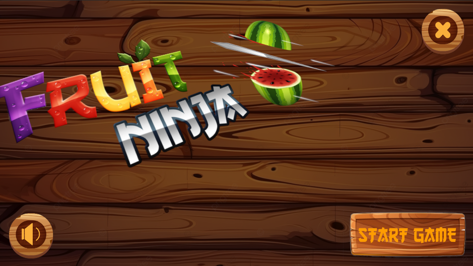
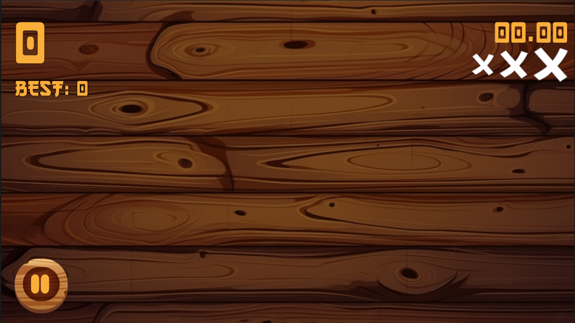
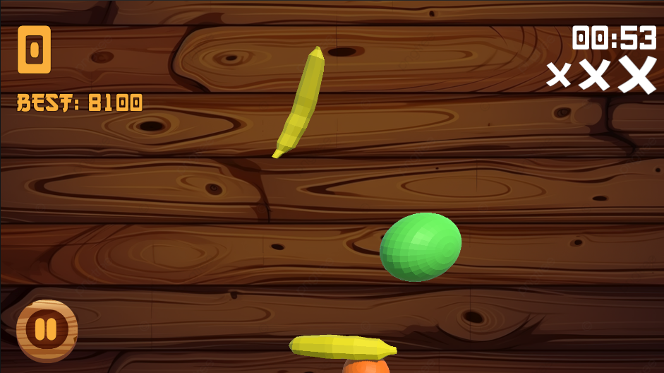
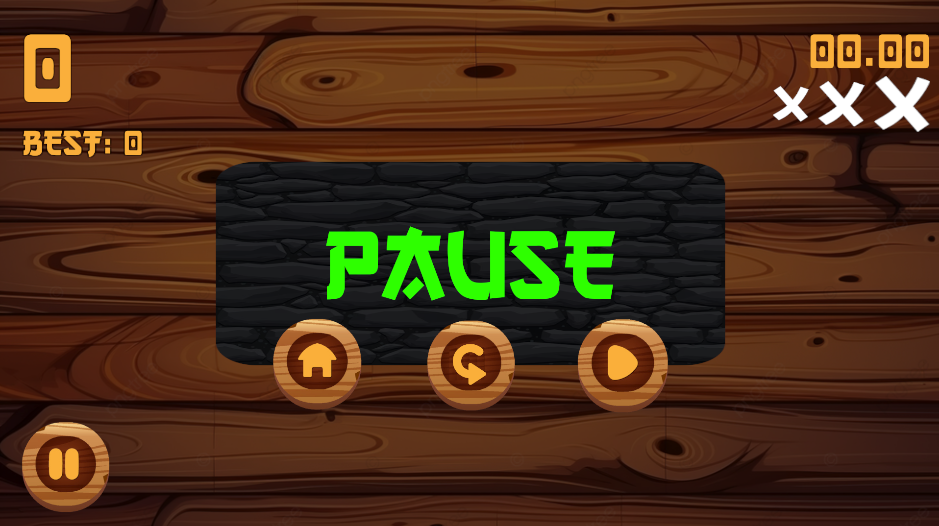
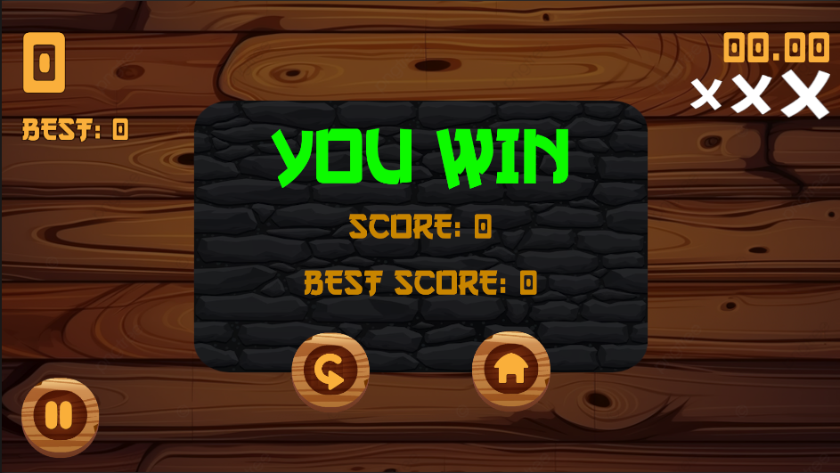
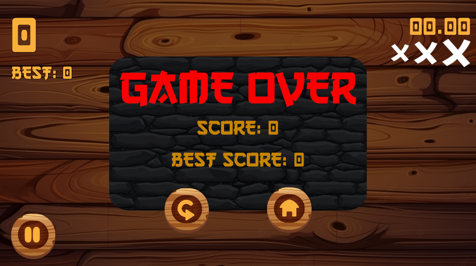

# 🍉🔪 Fruit Ninja - Desarrollo de Juego 🍉🔪

Este proyecto representa el desarrollo del popular juego Fruit Ninja utilizando Unity, un motor de juego ampliamente utilizado, junto con el lenguaje de programación C#.

## Descripción del Proyecto

Fruit Ninja es un juego de acción y destreza en el que los jugadores deben cortar frutas que son arrojadas al aire mientras evitan cortar bombas. Cada fruta cortada suma puntos, mientras que las bombas cortadas restan puntos y vidas. El objetivo es obtener la mayor puntuación posible en un tiempo determinado.

## Tecnologías Utilizadas

- **Unity Engine:** Utilizamos Unity como el entorno principal de desarrollo para implementar la lógica del juego, la física y los gráficos.
- **C#:** El juego está programado principalmente en C#, un lenguaje potente y ampliamente utilizado en el desarrollo de juegos en Unity.
- **Figma:** Para el diseño de los elementos visuales del juego, como botones y fondos, utilizamos Figma, una herramienta de diseño colaborativo en línea.

## Funcionalidades Principales

- **Mecánica del juego:** Implementamos la mecánica central del juego, que incluye el lanzamiento de frutas y bombas, y el corte de estos elementos por parte del jugador.
- **Sistema de Puntuación:** Creamos un sistema de puntuación para registrar la cantidad de frutas cortadas y penalizar el corte de bombas.
- **Temporizador:** Diseñamos un temporizador que limita la duración del juego, brindando un desafío temporal a los jugadores.
- **Interfaz de Usuario:** Desarrollamos una interfaz de usuario intuitiva que muestra la puntuación, el temporizador y otras indicaciones importantes para el jugador.

## Contribución

Si deseas contribuir al proyecto, ¡estamos abiertos a nuevas ideas y colaboraciones! Puedes contribuir reportando problemas, sugiriendo nuevas características o enviando solicitudes de extracción.

## Licencia

Este proyecto está bajo la Licencia [MIT](https://opensource.org/licenses/MIT). Consulta el archivo [LICENSE](LICENSE) para obtener más información.

## Capturas de Pantalla

A continuación, algunas capturas de pantalla del juego en acción:

## Instrucciones para Descargar

1. **Ir a la Sección de Lanzamientos:**
   - Dirígete a la pestaña de "Releases" en este repositorio de GitHub.

2. **Descargar el Archivo .exe:**
   - Busca el último lanzamiento disponible y haz clic en él.
   - Desplázate hacia abajo hasta encontrar el archivo ejecutable (.exe) asociado con el juego.
   - Haz clic en el enlace para descargar el archivo .exe en tu computadora.

3. **Instalar el Juego:**
   - Una vez que se haya descargado el archivo .exe, ejecútalo haciendo doble clic en él.
   - Sigue las instrucciones de instalación proporcionadas por el instalador.
   - Al finalizar la instalación, el juego se abrirá automáticamente y estará listo para jugar.

4. **Desinstalar el Juego:**
   - Si deseas desinstalar el juego en el futuro, ve a la carpeta donde está instalado y busca un archivo .exe dedicado para desinstalar el juego.
   - Haz doble clic en el archivo de desinstalación y sigue las instrucciones proporcionadas para completar el proceso de desinstalación.

¡Ahora estás listo para disfrutar del juego! Si tienes algún problema o pregunta, no dudes en comunicarte conmigo.

##LinkedIn 

Conéctate conmigo en LinkedIn para mantenernos en contacto y conocer más sobre mi trabajo como desarrollador.
[LinkedIn](https://www.linkedin.com/in/javierballon10/)
